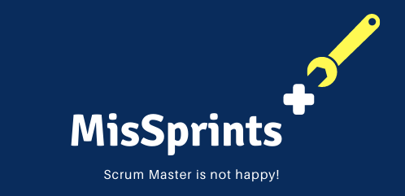
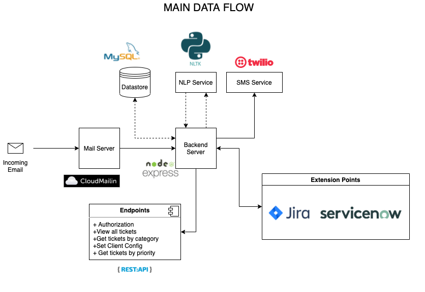

 
# Challenge 2: Automated Email Classifier for Issues and Service Requests

## Problem Definition

> Hard to maintain the SLA when the support team gets too many emails having to attend to them manually.

## Solution Architecture

## Team
| Name             | University | GitHub Handle  |
|------------------|------------|----------------|
| Suvin Nimnaka    | UCSC       | @suvink        |
| Dilhani Gamhatha | UCSC       | @Dil-G         |
| Nandula Perera   | UCSC       | @nandulaperera |
| Dilan Perera     | UCSC       | @RDPerera      |
| George Raveen    | UCSC       | @georgeraveen  |